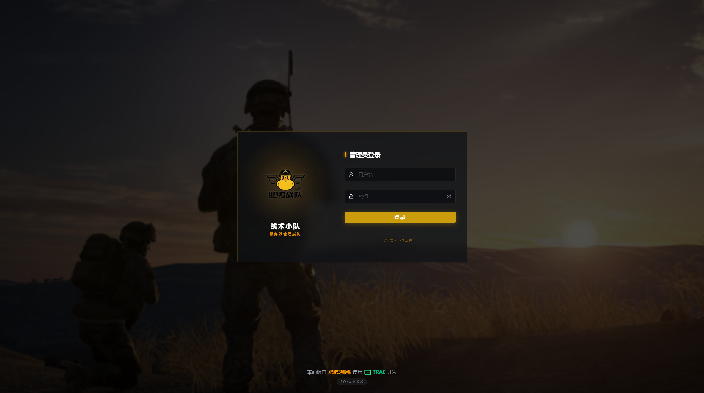

# Squad 战术小队服务器管理面板

基于 React 19 + TypeScript + Node.js + Prisma 的现代化 Squad 游戏服务器管理系统，为您提供高效、可视化的运维体验。



## ✨ 核心特性

- **服务器管理**：通过 RCON 轻松管理多个 Squad 游戏服务器，实时监控状态
- **实时仪表盘**：可视化展示在线玩家、服务器负载、管理员值班情况等关键数据
- **玩家管理**：查看玩家列表、踢出/封禁玩家、查询历史记录
- **RCON 终端**：内置网页版终端，直接执行原生 RCON 指令
- **配置编辑器**：在线编辑 `Server.cfg`、`Admins.cfg` 等配置文件，支持本地文件系统及 SFTP
- **日志分析**：强大的日志搜索与过滤功能，涵盖聊天日志、击杀日志及管理员操作审计
- **战队系统**：创建和管理战队/公会，审核成员申请
- **考勤系统**：自动统计管理员在线执勤时长，生成考勤报表
- **插件系统**：支持自定义 JavaScript 插件扩展功能
- **权限控制**：细粒度的角色权限管理（超级管理员、服务器管理员、观察员）

## 🛠️ 技术栈

### 前端
- **框架**: React 19 + TypeScript
- **构建工具**: Vite 7
- **UI 组件库**: Ant Design 6
- **状态管理**: Redux Toolkit
- **路由**: React Router 7
- **HTTP 客户端**: Axios
- **实时通信**: Socket.io Client
- **国际化**: i18next
- **图表**: ECharts, Recharts
- **样式**: TailwindCSS 4
- **测试**: Vitest + Testing Library, Playwright

### 后端
- **运行时**: Node.js
- **框架**: Express 5
- **语言**: TypeScript
- **ORM**: Prisma
- **数据库**: SQLite (开发) / PostgreSQL (生产)
- **实时通信**: Socket.io
- **认证**: JWT + bcrypt + speakeasy (2FA)
- **验证**: Zod
- **RCON**: squad-rcon
- **SFTP**: ssh2-sftp-client, basic-ftp

## 📦 快速开始

### 方式一：Docker 部署（推荐）

**前置要求**：已安装 Docker 和 Docker Compose

1. **克隆仓库**
   ```bash
   git clone https://github.com/feifei3yaya/sqfy-server-panel.git
   cd sqfy-server-panel
   ```

2. **配置环境变量**
   ```bash
   cp .env.example .env
   ```

3. **启动服务**
   ```bash
   docker-compose up -d
   ```

4. **访问面板**
   浏览器访问 `http://localhost:3000` (或您配置的端口)
   初始账号注册后将自动成为超级管理员

### 方式二：手动开发启动

**前置要求**：已安装 Node.js 18+ 和 npm

1. **克隆仓库**
   ```bash
   git clone https://github.com/feifei3yaya/sqfy-server-panel.git
   cd sqfy-server-panel
   ```

2. **安装后端依赖并启动**
   ```bash
   cd server
   npm install
   npm run dev
   ```

3. **安装前端依赖并启动**（新终端）
   ```bash
   cd client
   npm install
   npm run dev
   ```

4. **访问面板**
   浏览器访问 `http://localhost:5173` (Vite 开发服务器端口)

## 📁 项目结构

```
sqfy-server-panel/
├── client/              # 前端项目 (React + Vite)
├── server/              # 后端项目 (Node.js + Express)
├── config/              # 项目配置（SSH 密钥等）
├── docs/                # 项目文档
├── scripts/             # 部署和维护脚本
├── plugins/             # 插件目录
├── src/                 # 独立工具模块
└── docker-compose.yml   # Docker 编排配置
```

详细说明请查看 [项目结构文档](PROJECT_STRUCTURE.md)

## 🔌 插件开发

插件位于 `plugins/` 目录。每个插件是一个包含 `manifest.json` 和入口文件（如 `index.js`）的文件夹。

示例结构：
```
plugins/
  my-plugin/
    manifest.json
    index.js
```

## 🧪 运行测试

### 前端测试
```bash
cd client
npm test           # 单元测试
npm run test:e2e   # E2E 测试
```

### 后端测试
```bash
cd server
npm test
```

## 📝 开发工作流

1. **功能开发**：在对应模块目录下创建文件，遵循命名规范
2. **测试**：为核心功能编写单元测试
3. **构建**：`npm run build` 构建生产版本
4. **部署**：使用 Docker Compose 或手动部署到服务器

## 📄 许可证

MIT License

## 🔗 相关链接

- [Squad Wiki](https://squad.fandom.com/wiki/Squad_Wiki) - Squad 游戏百科
- [项目结构文档](PROJECT_STRUCTURE.md) - 详细的目录结构说明
