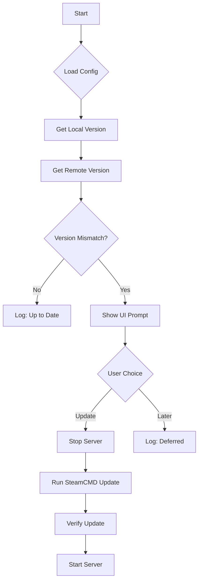

# Squad Update Manager

This PowerShell-based tool automates the process of checking for Squad Dedicated Server updates, notifying administrators, and applying updates using SteamCMD.

## Features
- **Automated Checks**: Compares local build ID with remote build ID.
- **Interactive UI**: Prompts user with "Update Now" or "Remind Later".
- **Safety**: Stops running server process before update.
- **Configurable**: Settings in `config.json`.
- **Logging**: Detailed logs in `SquadUpdateManager.log`.

## Installation
1. Ensure PowerShell 5.1+ is installed (default on Windows Server 2016+).
2. Install SteamCMD to `C:\steamcmd\steamcmd.exe` (configurable).
3. Place `SquadUpdateManager` folder on the server.
4. Run `SquadUpdateManager.ps1`.

## Configuration (`config.json`)
```json
{
    "SteamCmdPath": "C:\\steamcmd\\steamcmd.exe",
    "ServerPath": "D:\\squad_server",
    "AppId": "403240",
    "CheckIntervalMinutes": 60,
    "LogFile": "SquadUpdateManager.log",
    "ServerProcessName": "SquadGameServer"
}
```

## API Documentation (PowerShell Modules)

### `lib/SteamAPI.psm1`
- `Get-LocalBuildID`: Reads `appmanifest_403240.acf`.
- `Get-RemoteBuildID`: Queries SteamCMD for latest public build ID.
- `Update-GameServer`: Executes SteamCMD update command.

### `lib/UI.psm1`
- `Show-UpdatePrompt`: Displays WinForms dialog. Returns "UPDATE" or "LATER".

## Error Codes
- **0**: Success / No Update Needed
- **1**: Critical Error (Config missing, steamcmd fail, etc.)

## Update Flow

